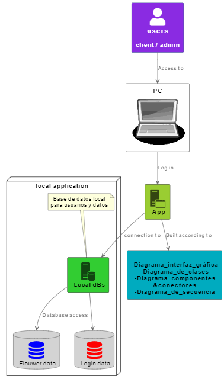
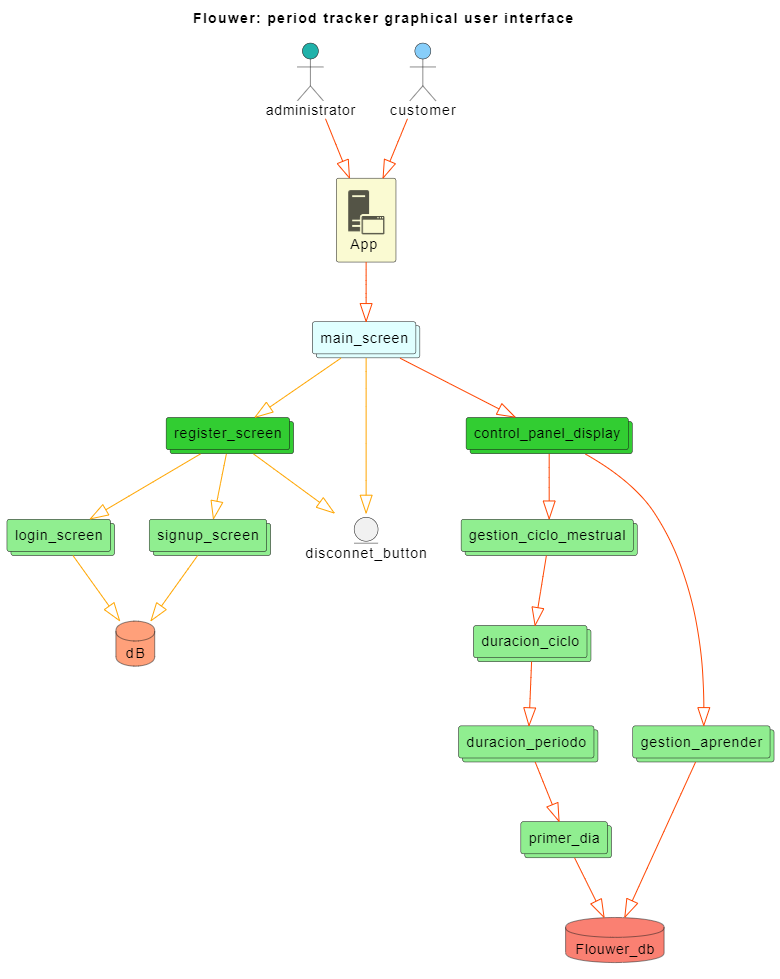
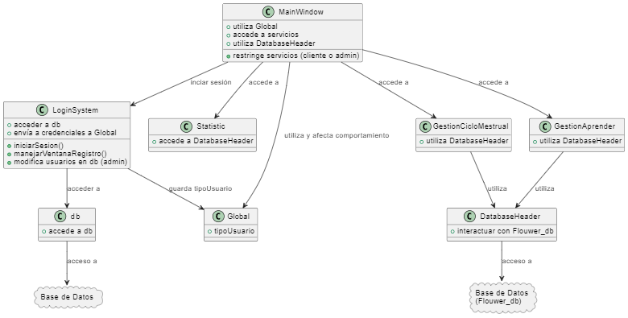
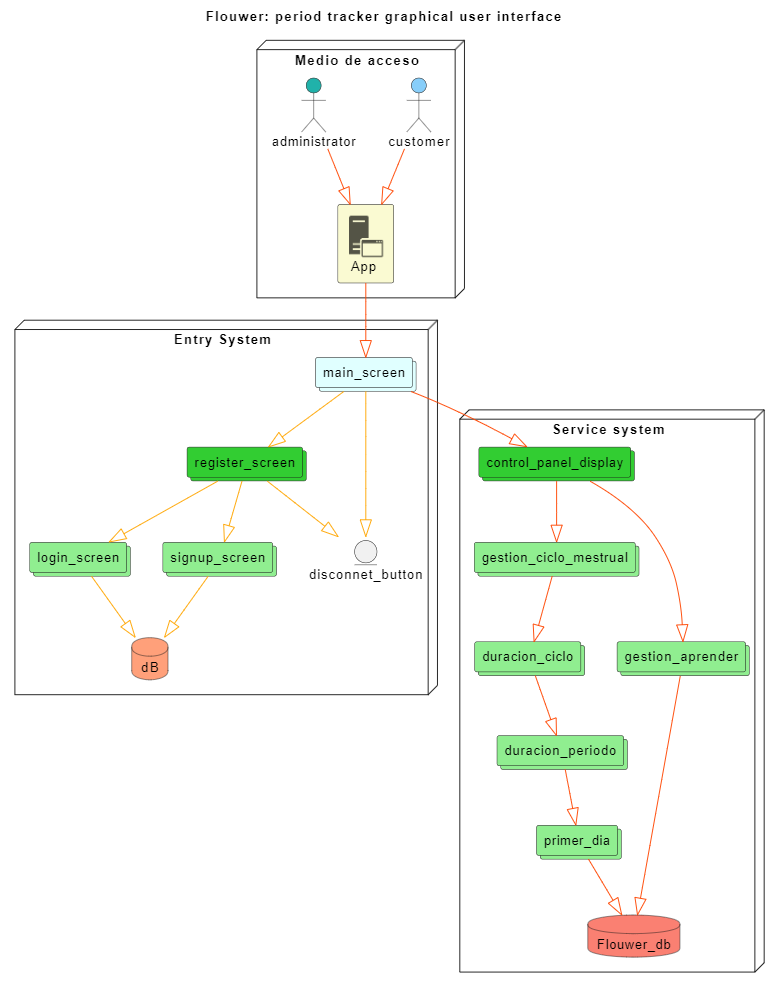
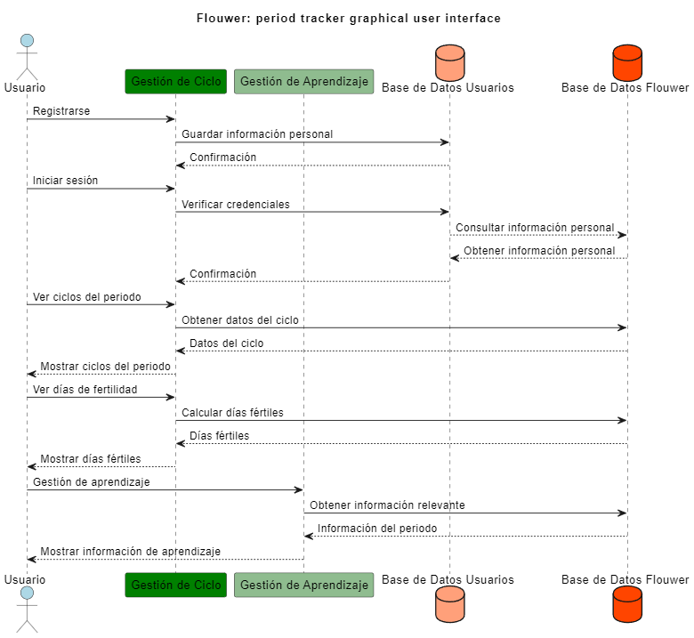

# Diagramas del Diseño a alto Nivel

## *Aplicación Flouwer*
## Objetivos que se buscan
#### 1. Acceso desde el telefono Android e iOS
#### 2. Permitir al usuario registrar su ciclo menstrual y otros datos relevantes.
#### 3. Informar sobre los dias con mayor posibilidad de generar un embarazo.
#### 4. Enviar recordatorios anticipados sobre el inicio próximo de su período para que pueda prepararse.
#### 5. Incluir recursos educativos, artículos y consejos relevantes para la salud menstrual y reproductiva.
#### 6. Utilizar los datos para predecir cuándo comenzará su próximo período.
#### 7. Calcular y predecir los días más fértiles.
#### 8. Tener una interfaz fincionable y amigable con el usuario.
### **Modelo Visual**

###   **Diagrama de flujo de la interfaz gráfica de usuario**

### **Diagrama de clases**

### **Diagrama de componentes y conectores**

### Diagrama de componentes visto desde la interfaz gráfica.

### **Diagramas de secuencia**
